  

  

 

  🚀 <strong>Frontend Software Engineer | Indie Game Developer | Entrepreneur</strong> 
  🔹 Founder of <a href="https://devzer.com">Devzer Studio</a> | Creator of <a href="https://onechariot.lk">OneChariot.lk</a> 
  🔹 Passionate about web development, game development, and crafting digital experiences

---

## 💻 About Me

- 🎨 Frontend Software Engineer at **Rightmo Web Solutions**
- 💡 Experienced in **React.js, Next.js, TypeScript, Tailwind CSS, and more**
- 🎮 Building indie games and web applications at **Devzer Studios**
- 🌍 Founder of **OneChariot.lk**, a classified ads platform for Sri Lanka
- 📚 Teaching JavaScript and React to aspiring developers
- 🎓 Graduated from **Coventry University (First Class Division)**

---

## 💫 Tech Stack

  
  
  
  
   
  
  
   
  
  

---

## 🔥 GitHub Stats & Animations

  

  

  
  

---

## 📫 Get in Touch

  🔗 <strong>Portfolio:</strong> <a href="https://hashan.dev">hashan.dev</a> *(Coming Soon!)* 
  💼 <strong>LinkedIn:</strong> <a href="https://linkedin.com/in/hashan-shalitha">linkedin.com/in/hashan-shalitha</a> 
  🐦 <strong>Twitter/X:</strong> <a href="https://twitter.com/hashaaan_dev">@hashaaan_dev</a>

Let's build something amazing together! 🚀

